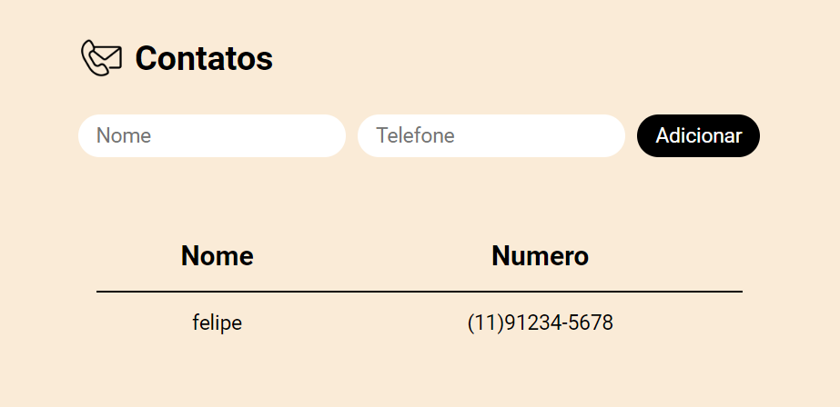

# Uma agenda de contatos simples para facilitar seu dia a dia

  

  <a href="#-tecnologias">Tecnologias</a>&nbsp;&nbsp;&nbsp;|&nbsp;&nbsp;&nbsp;
  <a href="#projeto">Projeto</a>&nbsp;&nbsp;&nbsp;|&nbsp;&nbsp;&nbsp;
  <a href="#desafio">Desafio</a>&nbsp;&nbsp;&nbsp;|&nbsp;&nbsp;&nbsp;
  <a href="#O-que-aprendi">O que aprendi</a>&nbsp;&nbsp;&nbsp;|&nbsp;&nbsp;&nbsp;

## 🚀 Tecnologias

Esse projeto foi desenvolvido com as seguintes tecnologias:

- HTML e CSS
- JavaScript
- Git e Github

## Projeto

O Site de agenda de contatos foi um projeto proposto pelo curso de full stack com python da EBAC, sendo que seu desenvolvimento visa o aprendizado do controle da DOM através do JavaScript.

## Desafio

Como parte de um exercicio para Integração de html com o js, o desenvolvedor deve ser capaz de:

- Crie uma aplicação de agenda de contatos;
- Contruir uma tabela, nesta tabela teremos as colunas:
nome e telefone
- Construa um formulário onde o usuário irá inserir o
nome e telefone do contato e ao clicar em cadastrar
uma linha será adicionada na tabela de contatos

Veja o resultado através do <a href="https://vercel.com/felipesilm/agenda-contato">link do Vercel</a>

## O que aprendi

O que aprendi com este desenvolvimento:

- Integração de JS com componentes HTML
- Controle da DOM pelas linhas de código
- Criar elementos DOM através do JavaScript
